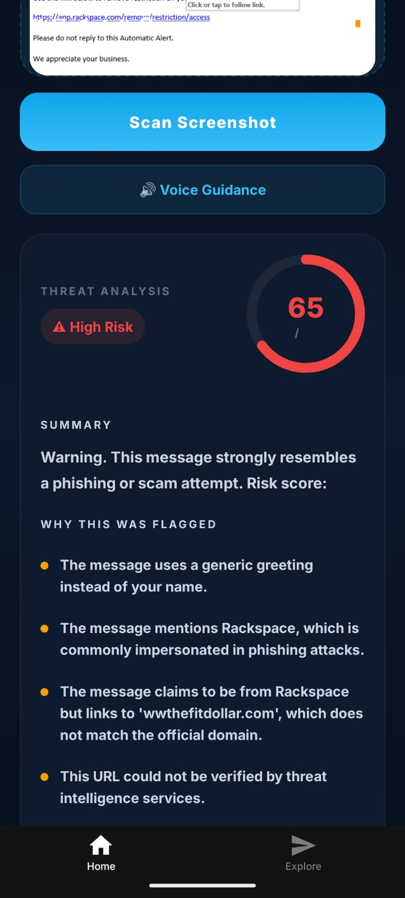
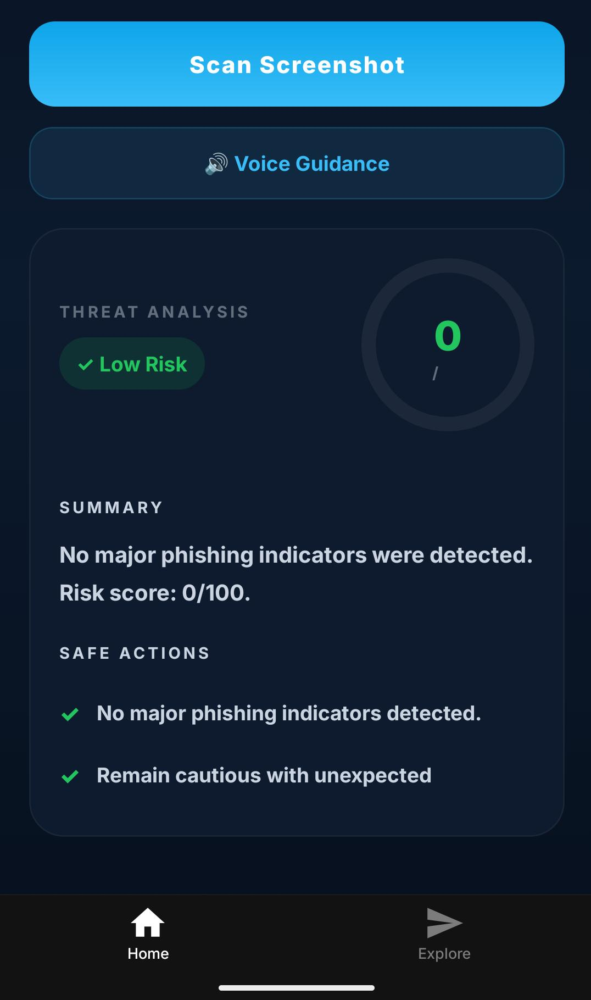
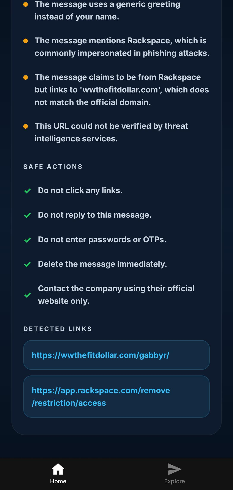

<div align="center">

#  BlindSight

### Accessibility-first cybersecurity assistant for detecting phishing, scams, and malicious links from screenshots.

BlindSight combines OCR, threat intelligence, phishing heuristics, and accessibility-focused design to help users identify cyber threats directly from screenshots in a fast, understandable, and mobile-friendly way.

<br/>


<br/>

[Features](#-features) •
[Screenshots](#-screenshots) •
[Architecture](#-architecture) •
[Getting Started](#-getting-started) •
[Roadmap](#-roadmap)

</div>

---

#  Overview

BlindSight is a mobile cybersecurity assistant designed to help users identify phishing attacks, scam messages, fake login pages, impersonation attempts, and suspicious links directly from screenshots.

Instead of relying only on technical users or enterprise security tools, BlindSight focuses on making cybersecurity analysis simple, visual, accessible, and understandable for everyday users.

The application performs:

- OCR-based text extraction
- Threat and phishing analysis
- URL reputation inspection
- Social engineering detection
- Accessibility-focused voice guidance
- Risk scoring and safe action recommendations

---

#  Problem Statement

Modern phishing attacks increasingly rely on psychological manipulation rather than technical exploits. Many scam messages appear visually convincing and are difficult for users to identify quickly.

BlindSight addresses this challenge by transforming screenshots into understandable cybersecurity insights using OCR, heuristic threat detection, and URL intelligence analysis.

The project is especially focused on accessibility-first cybersecurity experiences and simplified threat awareness.

---

#  Features

##  Threat Analysis Engine

- Phishing detection
- Scam pattern recognition
- Brand impersonation detection
- Credential harvesting detection
- Urgency and fear tactic analysis
- Social engineering detection

---

## 🔗 URL Reputation Intelligence

- Suspicious domain detection
- URL reputation scoring
- URL shortener detection
- Suspicious TLD analysis
- IP-based URL detection
- Threat intelligence-based URL inspection

---

##  Accessibility-Focused UX

- Voice-guided feedback
- High-contrast readable interface
- Mobile-first experience
- Calm and intuitive UI
- Clear risk visualization

---

##  Modern Mobile Experience

- Animated circular risk gauge
- Severity-based color system
- Smooth cyber-themed interface
- Premium dark-mode design
- Clean threat breakdown cards

# 📸 Screenshots

<div align="center">

| High Risk Detection | Low Risk Detection | Detected Links Analysis |
|---|---|---|
|  |  |  |

</div>
---
#  Demo

BlindSight analyzes screenshots of suspicious messages, phishing emails, fake login pages, and malicious links in real time to help users quickly identify cyber threats and avoid scams.

---

#  Tech Stack

| Layer | Technologies |
|---|---|
| Frontend | React Native, Expo, TypeScript |
| UI Components | React Native SVG, Expo Speech |
| Backend | FastAPI, Python |
| OCR | Tesseract OCR (`pytesseract`) |
| Threat Analysis | Heuristic phishing engine |
| Threat Intelligence | URL reputation analysis |

---

#  Architecture

```text
User Screenshot
       ↓
React Native Frontend
       ↓
FastAPI Backend API
       ↓
OCR Text Extraction
       ↓
Threat Analysis Engine
       ↓
URL Reputation Analysis
       ↓
Risk Scoring + Safe Actions
       ↓
Frontend Visualization + Voice Feedback
```

---

# ⚙️ How It Works

## 1. Upload Screenshot

The user uploads a screenshot of:
- suspicious messages
- scam emails
- fake login pages
- phishing attempts
- malicious links

---

## 2. OCR Extraction

BlindSight extracts readable text from the screenshot using OCR.

---

## 3. Threat Analysis

The backend analyzes:
- phishing indicators
- social engineering patterns
- urgency tactics
- impersonation attempts
- credential requests
- suspicious links

---

## 4. URL Intelligence

Detected URLs are inspected for:
- malicious reputation
- suspicious domains
- phishing indicators
- dangerous TLDs

---

## 5. Risk Scoring

A weighted heuristic scoring system generates:
- severity level
- risk score
- threat explanations
- safe action recommendations

---

## 6. Accessibility Feedback

Results are displayed visually and can also be explained through voice-guided feedback.

---

#  Getting Started

# Prerequisites

Install the following before setup:

- Node.js
- Python 3.8+
- Expo CLI
- Tesseract OCR

---

# 1. Clone Repository

```bash
git clone https://github.com/yourusername/BlindSight.git

cd BlindSight
```

---

# 2. Frontend Setup

```bash
cd frontend

npm install

npx expo start
```

---

# 3. Backend Setup

```bash
cd backend

pip install -r requirements.txt

uvicorn main:app --host 0.0.0.0 --port 8000 --reload
```

---

# 4. Environment Variables

Create a `.env` file inside:

```text
backend/
```

Add:

```env
API_KEY=your_api_key_here
```

---

# 5. Tesseract OCR Setup

Tesseract OCR must be installed separately.

## Windows

Download:
https://github.com/UB-Mannheim/tesseract/wiki

Then update path inside:

```text
backend/services/ocr_service.py
```

Example:

```python
pytesseract.pytesseract.tesseract_cmd = (
    r"C:\Program Files\Tesseract-OCR\tesseract.exe"
)
```

---

## macOS

```bash
brew install tesseract
```

---

## Linux

```bash
sudo apt install tesseract-ocr
```

---

#  Security Notes

- API keys are stored securely using `.env`
- Secrets are excluded using `.gitignore`
- No sensitive screenshots are permanently stored
- Threat analysis is performed locally on the backend

---

#  Roadmap

- [ ] LLM-based phishing classification
- [ ] QR phishing detection
- [ ] Browser extension integration
- [ ] Multilingual OCR support
- [ ] Real-time threat feed integration
- [ ] Offline threat analysis mode
- [ ] Advanced domain intelligence

---

#  License

This project is licensed under the MIT License.

---

#  Author

Developed by **Rewa Shukla**

> BlindSight — See through the scam.
